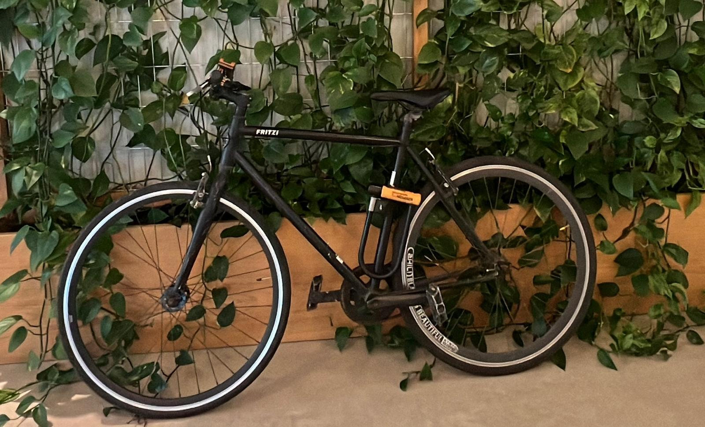
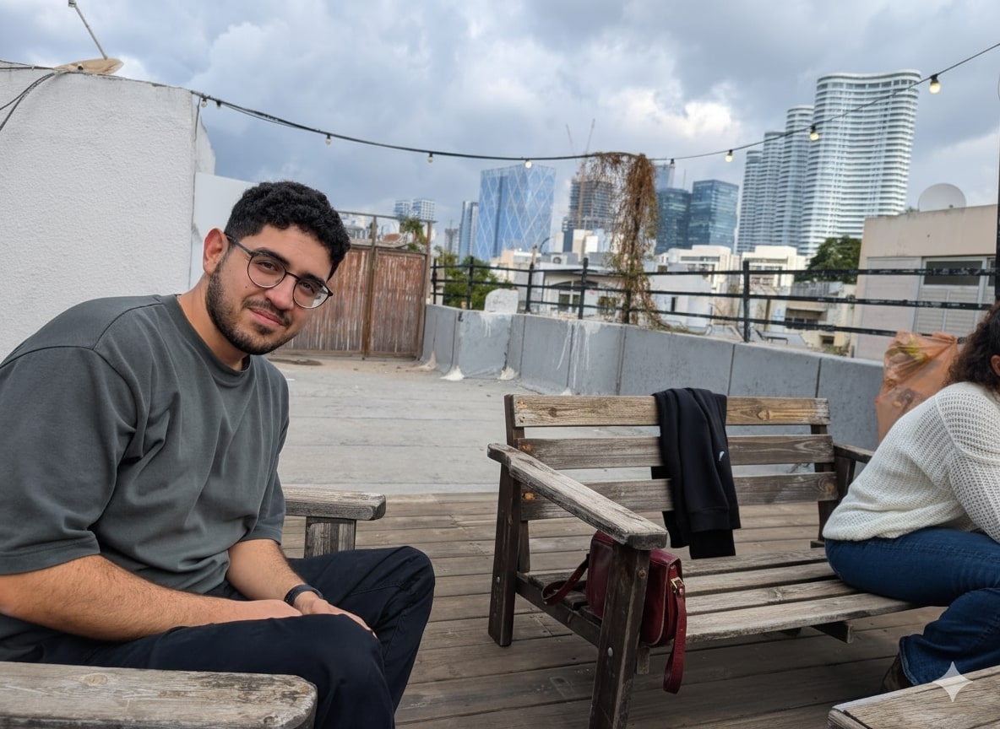

# 🛞 Please Don’t Steal My Bike

A fun, single-page static website that lives behind a QR code on **Gal Cesana’s bicycle**.  
When scanned, it politely (and humorously) informs potential thieves that this is **Gal’s bike**, not theirs — and provides proof of ownership, contact info, and a few strong arguments for leaving it alone.

## 🌍 Live Demo

👉 [Live Site](https://galcesana.github.io/pls-dont-steal-my-bike)

---

## 🚲 Project Overview

This project is a lighthearted way to **discourage bike theft** while showcasing simple, clean frontend design.  
The site combines **HTML, CSS, and vanilla JavaScript** — no frameworks, no build tools — and runs perfectly on **GitHub Pages**.

When opened with a query like `?found=1`, the site automatically switches into _Found Mode_, guiding good samaritans on how to return the bike.

---

## ✨ Features

- Fully static site – deploys easily on GitHub Pages
- Responsive and mobile-friendly
- Dark/light theme toggle with local storage persistence
- Automatic “Found Mode” via URL query (`?found=1`)
- Smooth-scrolling navigation and animated highlights
- Copy-to-clipboard for proof of ownership
- Wholesome humor and AirTag warning for extra protection

---

## 🧩 Project Structure

```
pls-dont-steal-my-bike/
│
├── index.html         # Main HTML file
├── style.css          # Site styling (light/dark themes)
├── script.js          # Navigation, theme toggle, found mode logic
├── favicon.ico        # Site icon
├── assets/images/
│   ├── my-bike.jpg    # Your bike
│   ├── owner.jpg      # You
│   ├── sky.jpg        # Your dog (security detail)
│   ├── background.jpg # Background texture
│   └── qr-bike.png    # QR code graphic
└── README.md          # This file
```

---

## 🛠️ How to Customize

1. **Edit details**  
   Open `index.html` and update:

   - Your name, contact info, and intro text
   - Bike name, color, and serial info
   - Replace image paths under `assets/images/`

2. **Replace images**

   - `owner.jpg` → your photo
   - `my-bike.jpg` → your actual bike
   - `sky.jpg` → your dog (optional but highly recommended for intimidation purposes)

3. **Deploy on GitHub Pages**

   - Push your changes to a GitHub repo
   - Go to **Settings → Pages → Source → Deploy from branch → main**
   - Set folder to `/ (root)`

4. **Generate your QR code**  
   Use a free QR generator for your deployed link with the `?found=1` parameter, e.g.:

   ```
   https://galcesana.github.io/pls-dont-steal-my-bike/?found=1
   ```

5. **Stick the QR code** on your bike — preferably somewhere visible but hard to peel off.

---

## 🧠 Tech Notes

- No dependencies, no build system — just HTML, CSS, and JS.
- Works offline once loaded.
- Supports both dark and light themes using CSS variables.
- Mobile menu closes automatically after navigation.
- Designed with accessibility (ARIA labels) and humor in mind.

---

## 📸 Preview

| Mode          | Screenshot                                  |
| ------------- | ------------------------------------------- |
| 💡 Light Mode |  |
| 🌙 Dark Mode  |     |

---

## 🐾 Credits

Created by **[Gal Cesana](https://www.linkedin.com/in/gal-cesana-844509217/)**  
Design & copy by Gal, CSS inspired by his portfolio theme.

---

## ⚖️ License

This project is open-source under the **MIT License**.  
Stealing this **code** is allowed. Stealing the **bike** is not.
